Below notes are taken while listening to youtube videos. 

**Date** : 14/October/2020    

##### The Most Important Thing - Origins and Inspirations, Howard Marks, Talks at Google (Very good)

<<See it again - There are many points>>

**Most important things**    

* The most important thing in investing is controlling risk. 
* The most important thing is buy at low price. 
* The most important thing is act as a contrarian

* *Memos are available in Oaktree Capital website for free - Download it*. 

* Personal philosophy comes from what you have taught by parents and teachers and your experiences. Experiences tell you what have been taught and have to be modified. 

* It is either, the most important badly written book or worst written very important book you will ever read. 

* **Book** : Decision making under uncertainty by C.Jackson Greyson

> In the world when there is randomness at work. You can't tell from outcome that decision good or bad. 
> In real world good decisions, fail to work all the time and bad decisions work all the time. 

* You should not act as if the things that should happen are the things that will happen. 
* If expected value is outcome. Don't think about single outcome, you think in terms of range of outcomes
* Should is not equal to will.  Lots of things that should happen fail to happen. Even if they fail to happen they fail to happen on schedule. 

* We cannot live on averages. 
* Investors should be good enough to go for winners. 

**Bonds**    

* AAA bonds are bonds that everybody think they are great. Companies are making lot of money, outlook is good, they have prudent balance sheets and everything is perfect. If everything is perfect it can't get better, if it cant get better than it can only get worse and there is only one way to go, DOWN. 
* Single B bond, I'd they survive, there is only one way to go for them, UP. On the other side, they can default and file bankruptcy. 

* Bond investing a negative art 

**How bond works**    

you know how bonds work, a bond is a promise to pay. You give me $100, and I promise to give you 5% interest every year, and then give your money back in 20 years. So, it does not make sense to pick and choose a bond, you can blindly pick a bond that pays and that will pay. Only thing that matters is exclude the one that doesn't pay. 

* The greatness of your performance comes not from what you buy but from what you exclude. 

**Oaktree's Investment Philosopy**    

1. The primacy of risk control
  - For excellence in investing, the most important thing is not making lot of money, is not beating the market, its not being in top quartile, the most important thing is controling risk. 
2. Emphasis on consistency
  - We don't try for the moon with the danger for crashing. I want to be above the middle on a consistent basis over the long term. 
3. The importance of market inefficiency
4. The benefits of specialization
5. Macro-forecasting not critical to investing
  - Its OKAY to have an opinion but you just shouldn't act as if it's right. 
6. Disavowal of market timing
  - We don't do market timing. We do long term investing on assets which are under priced. 

> Oaktree motto
> If we avoid the losers, the winners take care of themselves. 

* First the innovator, then the imitators, then the idiot

* Secret to happiness comes from prudence and caution. Its doesn't come from stroke of genius on the easy streak

**Date** : 06/October/2020    

##### The Education of a Value Investor, Talks at Google, Guy Spier

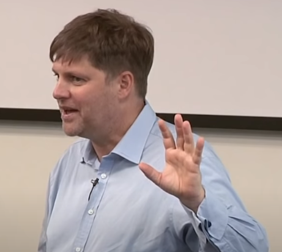
* Graduated from Harvard Business School 
* Attended Anthony Robbins seminar opened a new way of looking at the world. 
* From that point started figuring out, rule for how to improve my life 

* Compounding Good-will 
  - Compound interest is 8th wonder of the world.
  - Compound at any rate, over long period of time, it gets large very very quickly.
  - You can *Compound goodwill over time* and it gets large too.

  - Listen to Charlie Munger talk "24 standard causes of Human misjudgment".
  - Schldein talks about psychology of human judgement - Power of reciprocation.

  > I am slightly crazy in that way and when something grabs me, i just do it. Sometimes if it fascinates me, i do it with great intensity. So i set myself a goal of, i think 3 notes a day 5 days a week. Just kept sending it out. 

  - Meeting good people is compounded by human good will you do yourself.

* Power of Authencity 

* The idea of Resonance 
  - Example on bathtub and rubber duck and start making some waves. Eventually you can get the whole bathtub moving in one single wave. 

* Great book by Holldobler and Wilson: Journey to the ants.
  - Thinking about the world as an ant colony or rainforest.
* Fiction to say we are rational, we are rational in limited circumstances. 
* I think Im a better investor that I know I am not rational and this is something I have to deal with it and i have figure workarounds to make it better.
* Anthony Robbins "Matching and Mirroring" or Mohnish Pabrai calls it Cloning.
  - Even if we do a small fraction of our ideal investor gets us where we need to be in terms of profits.
  - Still be yourself while modeling your ideal.

* Conserve will power for things that count for example exercise in morning afterwards you cannot. 
* Create habits and behaviours that improve the probability that I will outperform the market.

NoteForMe : compare revenue, earnings and profit of companies in same sector may be read annual reports and get picture to sell or not 

**Guy's investments rules**     

1. Stop checking the stock prices
2. If someone tries to sell you something - don't buy it
3. Don't talk to management
4. Gather investment research in right order
5. Discuss investment ideas only with people who have no axe to grind
6. Never buy or sell stocks when the market is open
7. If a stock tumbles after you buy it don't sell it for 2 years  
8. Dont talk about your current investments

If you take S&P during 2009, it was very skewed by some overvalued companies, its sort of Market Cap-weighted index. So more these companies were overvalued, more they had to be in the index, so if you are investing in the index, its more skewed towards the opposite of value investing. Find indexes which are not skewed by looking at 'how the index is constructed'. 

Asked warren buffett *'How you deal with envy ?'*     

**WB** : I don't know. 

WB talks about 'Inner scorecard' idea. Work on something that gives you true joy. 

**Emotions are call to action.**     

Envy is a signal, to figure out something wrong in my life that i need to change. Fixing envy is by ensuring we go to bed everynight happy with what we did during the day. If we are not doing that, then we need to try really hard to get to doing that. 

* * * 

**Date** : 05/October/2020    

##### Investments and Portfolio Management Tactics, Brian Yacktman
* shiller cape ratio
* When ROA is low, companies will borrow money by doing it they jackup ROE. 
* Dupont analysis
* What are the earning on the assets
* Thinking about businesses which has pricing power
* People like associating with a brand
* Don't overpay in high quality stocks in high market

* * *

##### The Art of Investing, Talks at Google, François Rochon

> It is the long-term investor who will, in practice, come in for most criticism. It is in the essence of his behavior that he should be eccentric, rash and unconventional in the eyes of average opinion. 
> - The state of long-term expectation(1936), John Maynard Keynes

**How to NOT Beat the market**     

* Think the same way within same time horizon as other investors
* Own lots of companies so you dont differ much from average
* Believe you are smarter than others and can predict the market.

**Stock selection process**     

* Financial Strength: ROE > 15%, EPS Growth> 10%, Debt profit ratio <4x
* Business Model: Market Leader, High wide and deep Moat, Low Cycylicality
* Management Team: High level of ownership from CEO and CFO, constructive acquistions, Good capital allocations.
* Market Valuation: 5 years valuation model, Try to purchase at half the estimated value in 5 years (double money in 5 years, Around 15% annual return)

**Investment & Beauty**     

* Art and beauty are inter related. 
* How do you define beauty investment.
* We find something beautiful when its rare
* And something unique is the rarest of all 

Unique creates a wide and deep moat. 

**What we look for in a company is 3 things**
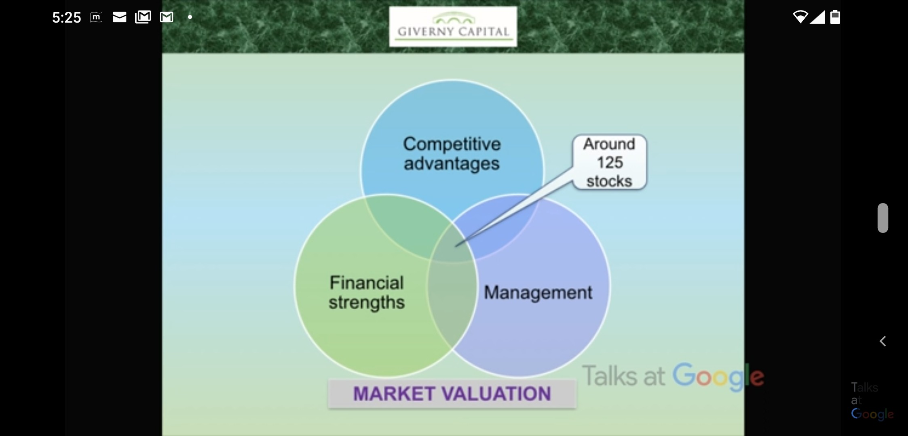

Market valuation comprises of these 3 circles,     

* Financial strength (science part)
* Management (judgement rationality)
* Competitive advantage (art part) 

When we overlap all these there are just 125 stocks.

Example: Walt Disney - Owners of unique characters. Mickey Mouse has 3 great qualities: Popularities, immortality and no agent. Keep making Alice in wonderful and jungle book like movies animation. Like you take oil from oil field and come back few years later and full of oil again. 

Example: carmax: PE ratio was 24 x in 2007 and 14 x later in 2014 etc. Athough PE ratio has gone down stock has done better. Done better than SPX.

Competitive advantage as investors is Patience, Humility and rationality 
* Humility means
  - We are not smarter than market, cannot predict macro economic events. 
  - Define your circle of competence (it is the boundary and not the size that matters). 
  - Recognize mistakes, learn from them for future investments. 

> Timing of purchases: 80% of success is showing up
> -Woody Allen

* Rationality
  - Dont get affected when others make money than you. 
  - Impervious to stock market quotations in short term. 
  - Accept we dont know the future and focus on what we have control (Our own process, companies that you understand and believe and own companies with great mangers).

**The Rule of 3**     

If you accept these rules, it will help you prepare psychologically,    

* One year out of 3 stock market will decline 10 % or more
* One out 3 stocks will not perform as expected. 
* One year out of 3, we wil underperform the index.

> "*Patience* is not ability to wait by keeping a good attitude while waiting."
Patience is neither denial nor stubborness. so we try not to get cooked like a frog in boiling water (when temperature is gradually increased).

When stock prices are falling, earnings start to deteriorate, debts are increasing see what's happening to the company that's what is happening to the stock. Just because you like the company don't stay in it.  

Good attitude is to focus on what is happening to company(earning improving) and not worry about stock price.     

**Earnings**: In case of Carmax; 2007-17 Over 10 years EPS grew 352% ad and Compund annual growth rate CAGR grew 16 %.

What differentiate an artistic investor from the conventional investor,
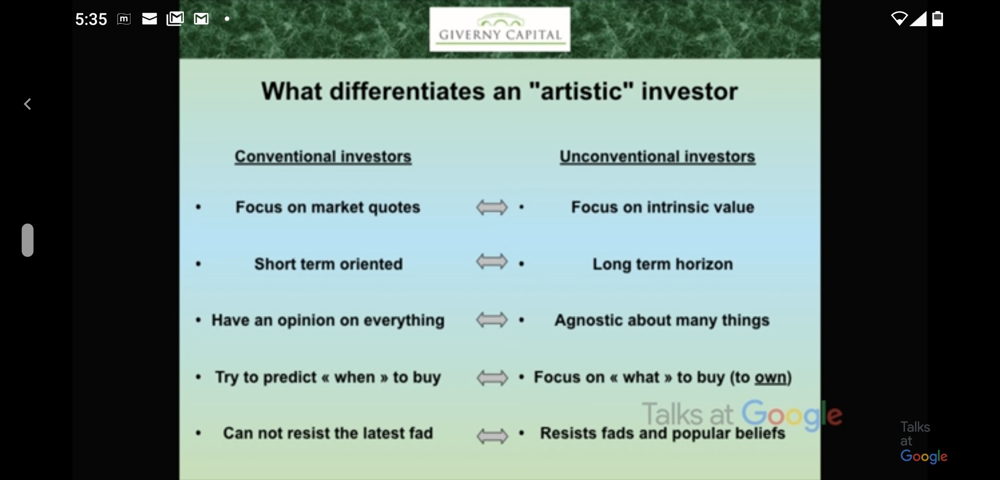

**A wise investor must be able to balance the inherent dualities in many human activites**
* *Love of the art* but you shouldn't fall in love with stocks, you should *be rational*
* You should have very *large fields of knowledge* to look at many many companies but at the same time *Focus on circle competence* 
* You want to be *Open-minded* but at the same time you have to have *Independence of thoughts*
* You want to be able to *Value the business* but at the same time you should be able to *go beyond numbers*
* You have to have *Patience* but at the same time *Don't get cooked like frog*
* You should have *Discipline* but you should be able to break the rules. Discipline is to follow your own rules, but wisdom is to know when to break the rules. 

What do we do differently at Giverny Capital? 
* We think independently 
* We own a few selected companies 
* We have a very long time horizon 
* We try to develop the right behaviors ( rationality, humility, patience )

* * *

**Date** : 03/October/2020    

##### The little book that beats the market, Talks at google, Joel Greenblatt

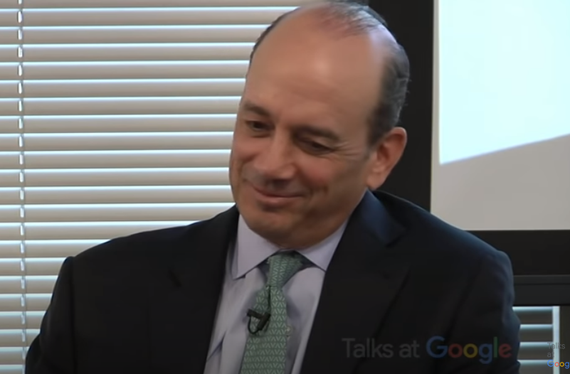

* How relatively this business is cheaper to similar businesses
* Be patient, follow the strategy. Last man standing is patience. We call it time arbitrage
* Beating the market is about getting more returns than  index funds
* Concentrated portfolios lose about 20% - 30% every 2-3 years. 

* * *

##### Investing the Templeton way, Talks at google, Lauren Templeton

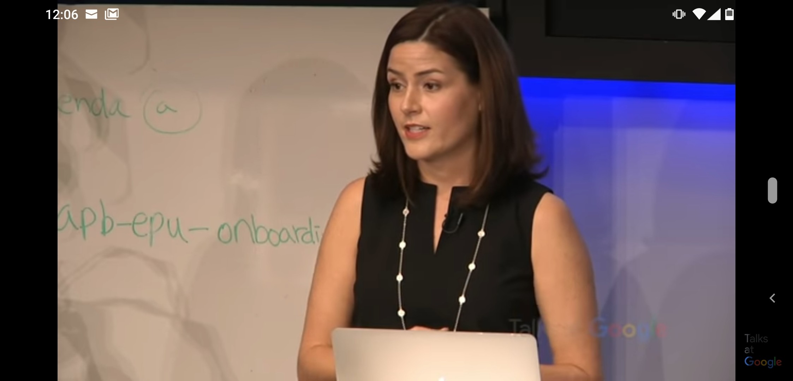

Quotes from Sir John Templeton
> "PEOPLE ARE ALWAYS ASKING ME where the outlook is good, but that's the wrong question. The right question is: "'Where is the outlook most miserable?" 

> "lf you want to have a better performance than the crowd, you must do things differently from the crowd." 

> "Bull markets are born on pessimism, grow on skepticism, mature on optimism and die on euphoria. The time of maximum pessimism is the best time to buy and the time of maximum optimism is the best time to sell." 

> "MAJOR CAUSE OF HIGHER PRICES is higher prices; but when the trend is reversed, then lower prices lead to still lower prices. To buy when others are despondently selling and to sell when others are avidly buying requires the greatest fortitude and pays the greatest ultimate rewards." 

**Trouble is opportunity**     

**Tech Bubble** : Insiders of the tech companies knew the companies were overvalued. Thing is there is this IPO lockup they cannot sell. 

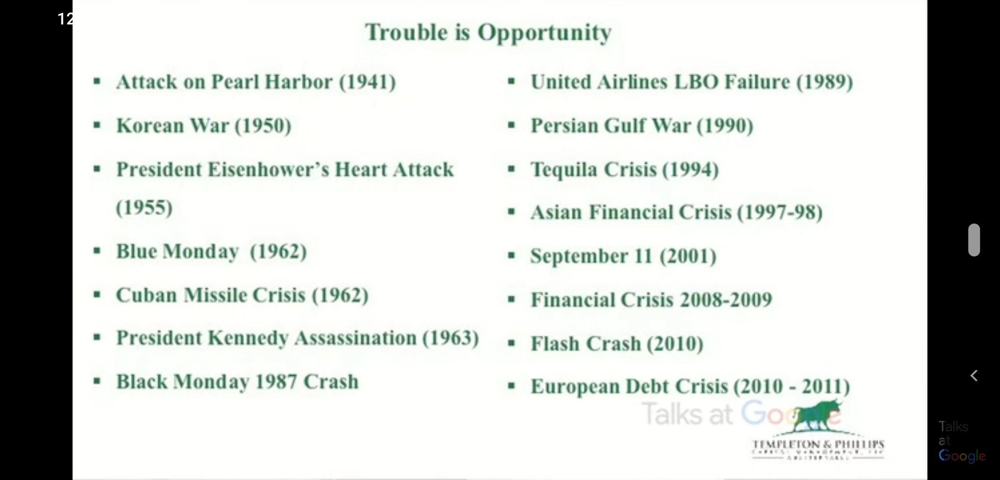

* Since 1900 there has been 125 corrections and 35 bear markets. Corrections come almost every year and best market every 3-4 years. 
* Average investors make 3.5% . Often they do is buy high sell low. 
* Mutual funds are terrible vehicle for managers as investors give money at wrong time and take out money at wrong time. So difficult to manage. 
* Don't confuse genius with the bull market
* Marshmallow test(delayed gratification kids win). Very difficult to buy at the bottom of there market. 
* If you cannot control your emotion you cannot be a good investor.
* Learn to buy at maximum pessimism
* Have patience. Lots of value investors don't live in business centres. 
* Have a list of undervalued stocks and buy during correction 
* Tech stocks are bought during market correction (Google Alibaba)
* You have to know yourself to be a good investor
* DCF based on industry
* Do little more work than peers

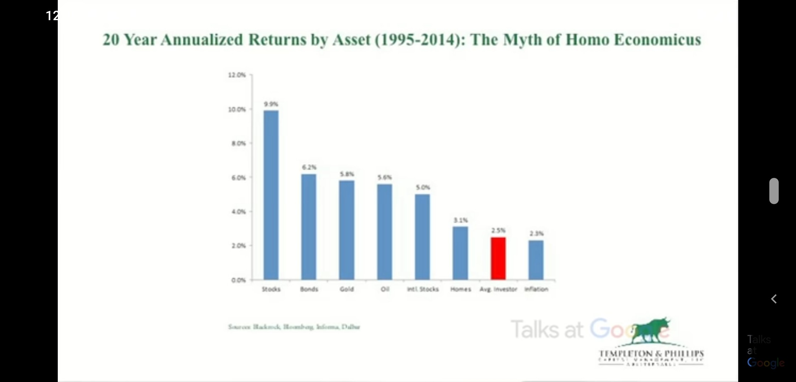

* * *

**Date** : 30/September/2020    

##### Viewing stocks as bonds, Talks at Google, Donald Yacktman 

> We like to buy beach balls being underwaterderwater with water levels rising.

**Investment Goals**     

* Protect capital against: 
  + Permanent loss of capital
  + Inflation

* Grow capital by:
  + Making double digit returns over time
  + Exceeding the S&P 500 Index return from market peak to market peak 

* In order to protect capital, you need to invest, equities gives higher rates of return
* Measure ourselves over a period of time that's appropriate, we feel real way to measure yourself is over a very long time period important one and we believe from one market peak to another market peak. 

**Investment Strategy: Desired Investment Attributes**    

1. Good Businesses that Dominate the industry
2. Shareholder-Oriented Management
3. Low Purchase Price
    

* **Good businesses**    

  a. Business with high ROTAs( returns on tangible assets) 
  b. Example consumer staples, low price used on regular basis. They have edge because they can manage capital much efficiently. 
  c. High market share and keeping the capital working you can make lots of money. 
  d. Eg: John Deere tractor business 17 years life cycle whereas toothpaste lasts only a month. So consumers companies handle well. 

  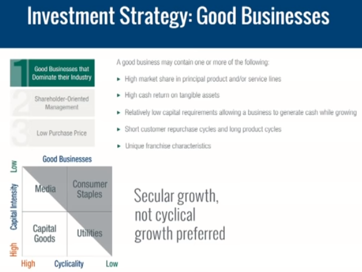

  * Media - Ad business, close economy and low capital
  * Utilities - Only way to get ROE up because you have low ROA is to leverage it. Need to have steady cash flows. Problem during depression they will go bankrupt. 
  * One thing to know about investment business is, you are almost wrong always to some degree, nobody buys everything at bottom and sells everything at top. So it's a business to stay humble. 

* **Shareholder-Oriented Management**     

  Investment process of management of the company,  when you buy equity, some part you get as dividend and other retained by management for reinvestment that's the wildcard. For long term second part is more important as it gives you more return. Management has 5 basic options on how to use the retained money, 

  1. Put money back in business, R&D ( marketing, distribution, cost reduction, sales). Marginal ROR on new incremwntal growth is excellent. When companies have excess cash which they can't absorb, they start examining 4 other options. 
  2. Dividends
  3. Sitting on cash( when you don't see opportunity sit on it )
  4. Acquisitions
  5. Buyback - Shareholders who have the stock get bigger piece of earnings

* **Low Purchase Price**     

  * Nobody can't predict the future, more predictable the company is narrower the range is and less predictable wider the range is. Have biggest holding on which you have strong confidence. Element is find great businesses at low price and hold for longer periods with patience. 
  * It's really important to be focused and patient. There is a narrow difference between being determined and stuborn. If at the end of the day you are right you are determined. In a long horizon of time it really makes a difference  and it really does separate us from so many people out there. 
  * There is tremendous pressure in this business for short time results and horizon time is 3 years in a underperforming market.
  * High quality stocks ( AAA rated ) tend to hold better during crash, you can sell some of those to buy companies with ratings A or AA which has more upside potential. (Always have cash reserve ). This can dramatically increase your ROR. 
  * Lots of reasons for insiders to sell stock but only one reason to buy stock from personal money. ( Philip Morris & Carlos Slim )
  * Retail is a tough business
  * Amazon has a unique business
  * Apple has niche business model but if there is a another product with 60-70% same feature with 2/3 of cost or half cost that's the one to go. 
  * Short term is the voting machine and long term is the weighing machine. 70% are moment investors they buy what is good with thrusts it's gonna be better. 
  * Financial stocks are low return on assets as they make money through leverage that makes them very vulnerable. 
  * Buy during crash, industry shortfall( 93 health care Clinton, drug and Pharma was taking a hit) 
  * Be protective and aggressive at the same time

* * *

**Date** : 29/September/2020    

##### Wealth building with one thing & millionaire series, google talks,  Jay Papasan

> Self-Assessment 
> Make a careful exploration of who you are and the work that you've been given, and sink yourself into that Don't be impressed with yourself. Don't compare yourself with others. You must do your creative best with your own life. 

One thing. Idea of one thing is that you have clear priority.  If you align your priorities over time. You get huge momentum and leverage in your actions. 2inch domino can knock down Eiffel tower.

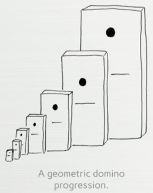

 Compound interest is the eighth wonder if the world. Good habits, diet, financial habits compound. Live on less than I earn and invest the rest. Positive habits and negative habits define us and being aware of them and purposeful in building them is one of the powerful thing you can do. If you start working for your habits, whats beautiful is quickly they will start working for you. Success is sequential not simultaneous. Look at your to-do list on weekly basis and prioritze them.  In the todo list always prioritise by numbering them. Work on the one.  

**What is your WHY**    

* Why is that goal important to you
* What will accomplishimg that goal do for your life ? 
* What will happen if you do not accomplish this goal ? 

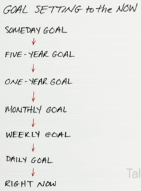

* Go into the future work backwards
* Investment should earn atleast 3.5% annually, lower is dead money, it's losing its value. 

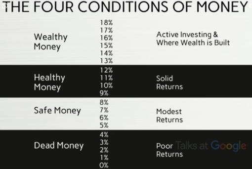
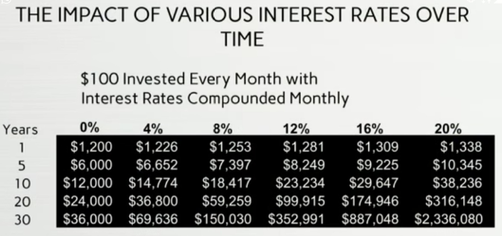
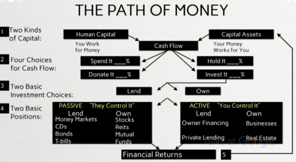

**Habits of the Wealthy**    

  * Write down their goals 
  * Focus on a single purpose 
  * Don't procrastinate (& are action oriented) 
  * Wake up three hours before they have to be at work 
  * Read 30 minutes a day 
  * Read 2 or more educational books per month 
  * Network 5 hours or more each month 

* * *

**Date** : 30/September/2020    

##### Top 10 rules of Warren Buffett

  1. Don't get hung up on mistakes. Tomorrow is another day, go for the next thing. 
  2. Don't sleep walk through life. 
  3. Paint what you want. You got the brush and canvas is unlimited. 
  4. Think independently.  
  5. Be in a good environment and friends. 
  6. Defining your circle of competence is the most important thing in investing. Understand the economic characteristics of a business. 
    > “I’m no genius. I’m smart in spots—but I stay around those spots.”     
    > — Tom Watson Sr., Founder of IBM
  7. Assigning yourself right story and go write the story. 
  8. Public speaking & Bring the best out of people are good talents need to have. 
  9. Need to have emotional stability

* * *

##### Top quotes of Warren Buffett
  1. Somebody once said that in looking for people to hire, you look for three qualities: integrity, intelligence, and energy. And if you don't have the first, the other two will kill you. You think about it; it's true. If you hire somebody without integrity, you really want them to be dumb and lazy.

* * *

##### Top quotes of Charlie Munger     

  1. Take a simple idea and take it seriously.
  2. People calculate too much and think too little
  3. The big money is not in the buying or the selling, but in the waiting.
  4. What are the secrets of success? – one word answer: "rational"
    > rational : based on or in accordance with reason or logic.
  5. Knowing what you don’t know is more useful than being brilliant.
  6. If something is too hard, we move on to something else. What could be simpler than that?”
  7. Remember that reputation and integrity are your most valuable assets — and can be lost in a heartbeat.
  8. Spend each day trying to be a little wise than you were when you wake up.

* * *

**Date** : 01/July/2020    

##### Wealth Is What You Don’t Spend, Morgan Housel

* Learning to contently live with less has the same effect as growing your income
* Money is often a negative art. 
  - It has a lot to do with the actions you don’t take and things you avoid.
* Everything has a price, and prices aren’t always clear. 
  - The price of exercise(fitness) isn’t just the workout; it’s avoiding the post-workout appetite. Same in finance. The price of building wealth isn’t just the trouble of earning money; it’s avoiding the post-earnings urge to spend what you’ve accumulated.
