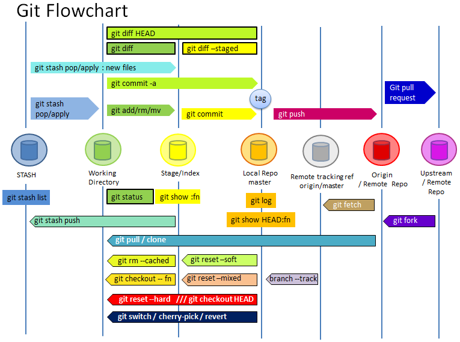

This picture, sort of gives an overview of some major git commands and where it fits in the Git World

  

Below are some useful git commands, tests and references. 

| Description   | commands                               |
| :--------- | :---------------------------------------- |
| List of all files in a commit tree | git ls-tree --name-only -r HEAD |
| List of all files changed in a commit | git diff-tree --no-commit-id --name-only -r HEAD |

#### # References
* [Git glossary](https://git-scm.com/docs/gitglossary)
* [Pro Git](https://git-scm.com/book/en/v2)
* [Vogella : Git](https://www.vogella.com/tutorials/Git/article.html)
* [GitHowTo](https://githowto.com/)
* [A Git Workflow for Agile Teams](http://reinh.com/blog/2009/03/02/a-git-workflow-for-agile-teams.html)

Cheatsheet
* [arslanbilal/git-cheat-sheet](https://github.com/arslanbilal/git-cheat-sheet/blob/master/README.md)
* [git-tips/tips](https://github.com/git-tips/tips)

Visualizations
* [Bit-Booster - Offline Commit Graph Drawing Tool](http://bit-booster.com/graph.html)
* [CS Visualized: Useful Git Commands](https://dev.to/lydiahallie/cs-visualized-useful-git-commands-37p1)
* [A Visual Git Reference](https://marklodato.github.io/visual-git-guide/index-en.html)

Rebasing
* [Rebase workflow : Randy Fay](https://randyfay.com/content/rebase-workflow-git)
* [Rebase workflow : Catherine Chepkurui](https://medium.com/@katherinekimetto/git-rebase-rebase-then-merge-86c0b1d18973)
* [Rebase example: YT](https://www.youtube.com/watch?v=CEtqad1jM2E&t=767s) : Order of commit is changed. 

Git flow 
* [A successful Git branching model](https://nvie.com/posts/a-successful-git-branching-model/)
* [Issues with git-flow](http://scottchacon.com/2011/08/31/github-flow.html)

Git advance topics
* [Git Extras](https://github.com/tj/git-extras)
* [BFG Repo-Cleaner : Removes large blobs](https://rtyley.github.io/bfg-repo-cleaner/)
* [Rewriting Your Git History and JS Source for Fun and Profit](https://blog.isquaredsoftware.com/2018/11/git-js-history-rewriting/)

#### # Git Theory 
* **[Origin](../44-git-theory-1)** : How it all began. What is git ? and Terminologies used in this series. 
* **[Basics](../45-git-theory-2)** : config, init, add, rm, .gitignore, commit, log, blame, diff, tag, describe, show and stash
* **[Undos](../46-git-theory-3)** : checkout, reset, revert and restore
* **[Branching](../47-git-theory-4)** : Git Branching
* **[Internals](../48-git-theory-5)** : Git Internals
* **[Collaboration](../49-git-theory-6)** : Git remote repository

