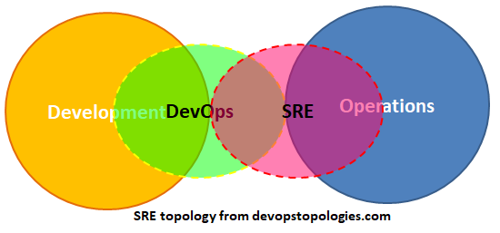

Devops and Site Reliability Engineering(SRE) are most discussed subjects in the software industry and there is some confusion and questions around the subject as well like, 
* Is Devops and SRE are they different or same thing ?
* Or is it more like "Devops Vs. SRE" 
* Or is SRE next level of Devops ?

DevOps & SRE might have orginated around the same time but in different worlds like DevOps was adopted and followed by many organizations and open-source communitites around the world whereas SRE was founded and practiced by only one organization in the world(ie., Google) and they called it as their 'Secret Sauce'. 

What is DevOps ? 
DevOps is a set of practices that combines software development (Dev) and IT operations (Ops). It aims to shorten the systems development life cycle and provide continuous delivery with high software quality. DevOps is complementary with Agile software development; several DevOps aspects came from Agile methodology. Practices in DevOps such as automated build and test, continuous integration, and continuous delivery originated in the Agile world. 

Agile can be viewed as addressing communication gaps between customers and developers, while DevOps tries to addresses gaps between developers and IT operations but focuses on short and frequent deployments. 

Goals of DevOps
* Improved deployment frequency;
  - Continuous delivery
  - Using version control for all production artifacts
  - Automated testing
* Faster time to market;
* Lower failure rate of new releases;
* Shortened lead time between fixes;
* Faster mean time to recovery (in the event of a new release crashing or otherwise disabling the current system).
  - Monitoring system and application health

Agile Software Development is based on twelve principles:
* Customer satisfaction by early and continuous delivery of valuable software.
* Welcome changing requirements, even in late development.
* Deliver working software frequently (weeks rather than months)
* Close, daily cooperation between business people and developers
* Projects are built around motivated individuals, who should be trusted
* Face-to-face conversation is the best form of communication (co-location)
* Working software is the primary measure of progress
* Sustainable development, able to maintain a constant pace
* Continuous attention to technical excellence and good design
* Simplicity—the art of maximizing the amount of work not done—is essential
* Best architectures, requirements, and designs emerge from self-organizing teams
* Regularly, the team reflects on how to become more effective, and adjusts accordingly

DevOps defines 5 key pillars of success:
* Reduce organizational silos
* Accept failure as normal
* Implement gradual changes
* Leverage tooling and automation
* Measure everything

**What is SRE**    

Site Reliability Engineering (SRE) is a discipline that incorporates aspects of software engineering and applies them to infrastructure and operations problems.[1] The main goals are to create scalable and highly reliable software systems. According to Ben Treynor, founder of Google's Site Reliability Team, SRE is "what happens when a software engineer is tasked with what used to be called operations.

SRE are more focused towards keeping production avaialble, scalable and reliable. SREs activites and development efforts will be more focussed towards keeping production avaialble, scalable and reliable

| Devops   | SRE                                         |
| :--------- | :---------------------------------------- |
| Reduce organization silos | SRE shares ownership with developers to create shared responsibility.   SREs use the same tools that developers use, and vice versa |
| Accept failures as Normal | SREs embrace risk   SRE quantifies failure and availability in a prescriptive manner using Service Level Indicators (SLIs) and Service Level Objectives (SLOs)   SRE mandates blameless post mortems | 
| Implement gradual change | SRE encourages developers and product owners to move quickly by reducing the cost of failure | 
| Leverage Tooling and automation | SREs have a charter to automate manual tasks (called "toil") away | 
| Measure everything | SRE defines prescriptive ways to measure values   SRE fundamentally believes that systems operation is a software problem | 

  

From this, its easy to understand that DevOps and SRE focus on different areas. ie., DevOps focuses on Software Development and SRE focuses on Production Management. These two subject are not competing against each other but share similar core values and both have practices unique to each other. One unique feature in SRE is Error budget, where both SRE and developers agree on a SLA and which gives out error budget and as long as dev team have this error bugget they can use it to deploy new features but if they run out of error budget, their development get frozen until end of quarter or till number of errors reduces. 

Technically to say "Class SRE implements DevOps"

Just remember,
> More you communicate, less you have to assume

Below are some notes on SRE, 
* [Taken while watching youtube videos](../51-sre-notes-from-youtube)
* [While reading Google SRE Book](../52-sre-reliability-engineering)

##### Materials
* [SLO Cheatsheet](https://storage.googleapis.com/bobbydreamer-com-technicals/53-sre-references/%5Bshared%5D_SRE_The_Art_of_SLO_cheat_sheet.svg)
* [Art of SLOs](https://landing.google.com/sre/resources/practicesandprocesses/art-of-slos/)
  - [Art of SLOs - Handbook](https://storage.googleapis.com/bobbydreamer-com-technicals/53-sre-references/art-of-slos-handbook-a4.pdf)
  - [Art of SLOs - Slides](https://storage.googleapis.com/bobbydreamer-com-technicals/53-sre-references/art-of-slos-slides.pdf)
  - [Art of SLOs - How to](https://storage.googleapis.com/bobbydreamer-com-technicals/53-sre-references/art-of-slos-howto-a4.pdf)

##### References
* [Site Reliability Engineering Resources](https://sre.xyz/)
* [Do you have an SRE team yet?](https://cloud.google.com/blog/products/devops-sre/how-to-start-and-assess-your-sre-journey)
* [SRE Best practices](https://landing.google.com/sre/sre-book/chapters/service-best-practices/)
* [Setting SLOs: a step-by-step guide](https://cloud.google.com/blog/products/management-tools/practical-guide-to-setting-slos)
* [Availability tables](https://landing.google.com/sre/sre-book/chapters/availability-table/)
* [20 Essential Books for Site Reliability Engineers](https://blog.catchpoint.com/2020/02/26/20-essential-books-for-site-reliability-engineers/)