Since i am into colors and everything, i was poking around `node_modules` to change the current gatsby theme colors. Finally i found the .js file where the color details are specified and i started to playaround with it. 
```sh
bdv2\node_modules\@lekoarts\gatsby-theme-minimal-blog\src\gatsby-plugin-theme-ui\index.js
```

Here are the things, i tried. 

### # Original color theme

**Light**     
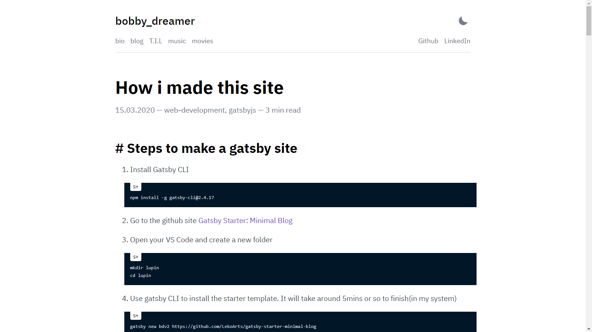  

**Dark**    
This uses 
```sh 
    modes: {
      dark: {
        text: tailwind.colors.gray[4],
        primary: tailwind.colors.purple[5],
        secondary: `#7f8ea3`,
        toggleIcon: tailwind.colors.gray[4],
        background: `#1A202C`,
        heading: tailwind.colors.white,
        divide: tailwind.colors.gray[8],
        muted: tailwind.colors.gray[8],
      },
    },
```    

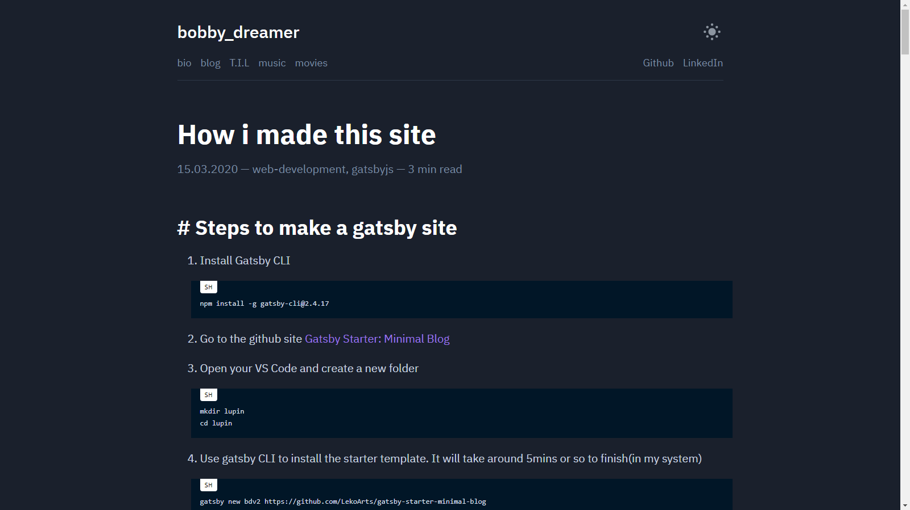  

### # What CSS key correspond to
```sh 
background: page background
primary: post links / selected text
secondary: tags, header links
heading: headings
toggleIcon: light/dark mode
```

### # Light theme : 1
This uses 
```sh
    light:{
      background: `#e8e6d9`,
      secondary: `#f23807`
    }
```    

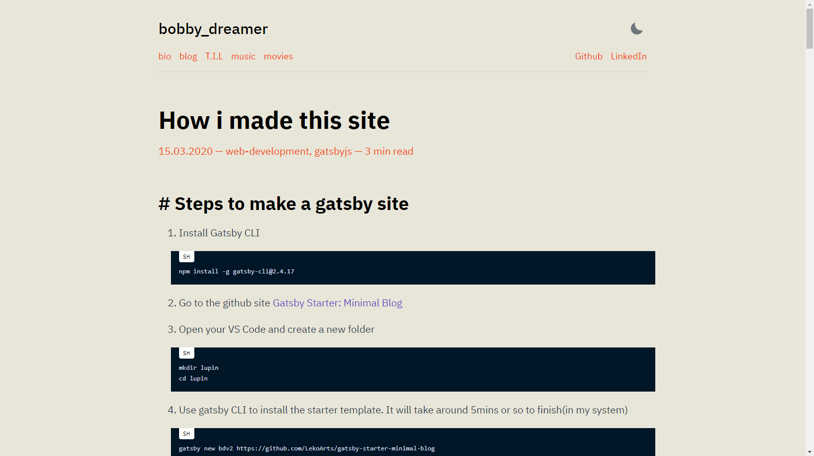 

### # Light theme : 2
This uses
```sh 
    light:{
      background: `#d0e1f9`,
      secondary: `#ee4035`
    }
```    

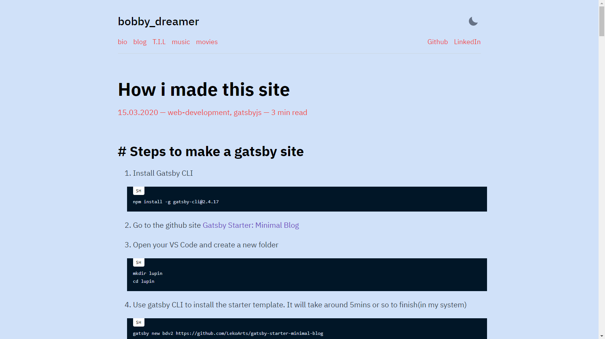 

### # Light theme : 3
This uses 
```sh
    light:{
      background: `#dcf3e8`,
      primary: `#f11818`,
      secondary: `#f11818`,
      heading: `#2f41cd`,
    }
```

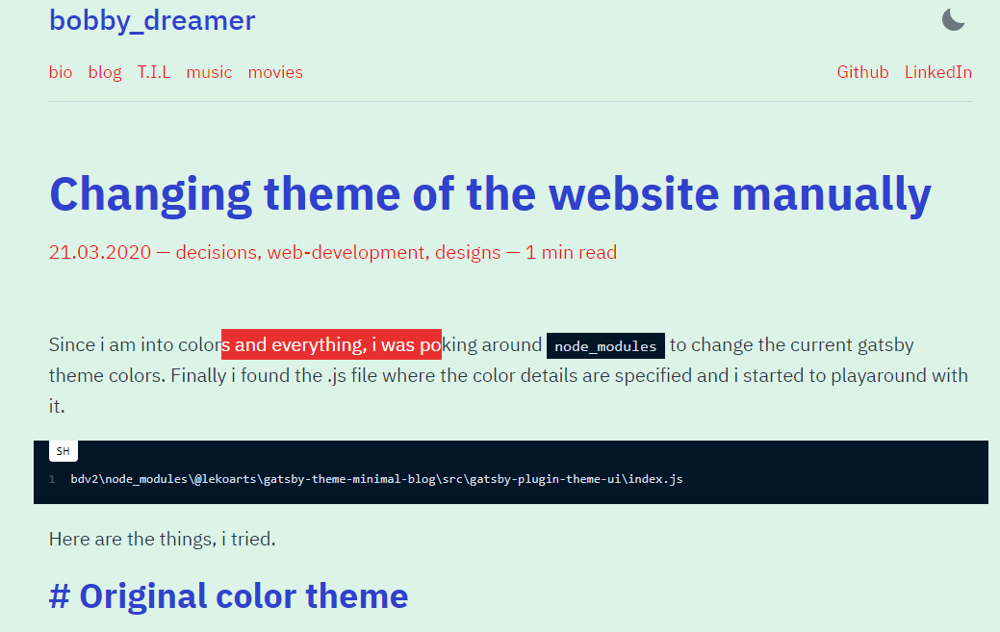 

### # Light theme : 4
This uses 
```sh
      light:{
        background: `#ffd8d8`,
        primary: `#0bbd59`,
        secondary: `#0bbd59`,
        heading: `#2f41cd`,
      }
```

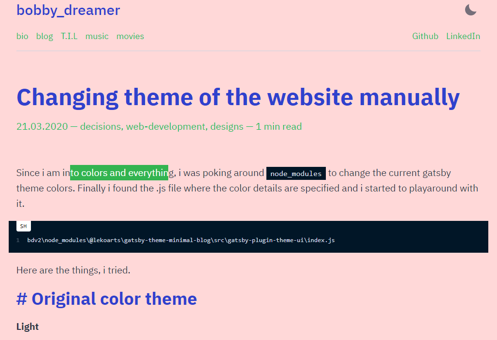 

### # Light theme : 5
This uses 
```sh
    light:{
        background: `#28e49a`,
        heading: `#000000`,
        primary: `#ff0000`,
        secondary: `#ffffff`
    }
```

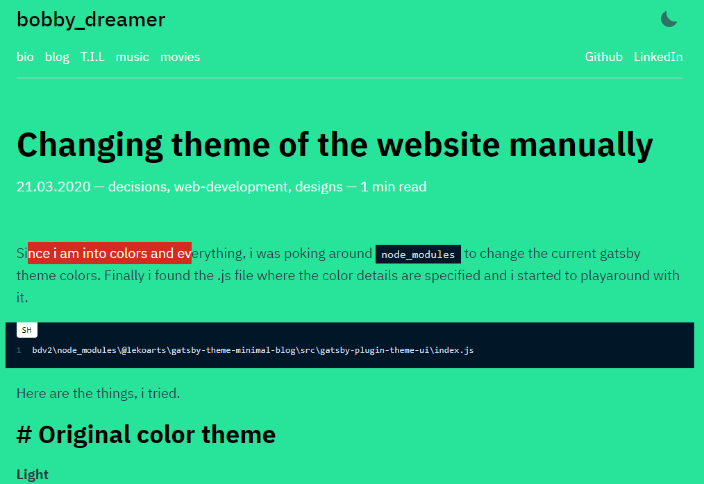

### # Light theme : 6
This uses 
```sh
    light:{
        background: `#e4f7b5`,
        heading: `#0b1ac3`,
        primary: `#8f85c2`,
        secondary: `#e41b3f`
    }
```

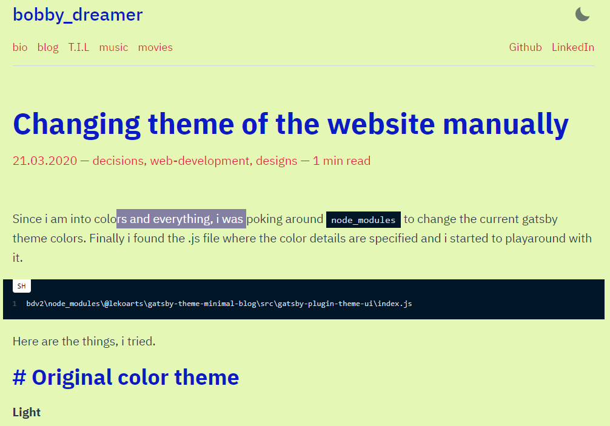 

### # Dark theme : 1
This uses 
```sh 
    dark:{
      background: `#1e172c`,
      secondary: `#f725a0`,
      primary: `#0cb2c0`,
    }
```    

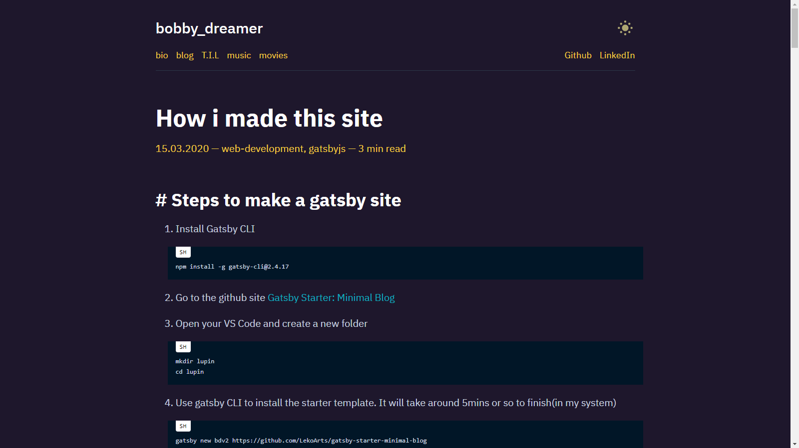 

### # Dark theme : 2
This uses 
```sh 
    dark:{
      primary: `#fad141`,
      background: `#1e172c`,
      secondary: `#2ab7ca`,
      heading: `#ff0080`,
      toggleIcon: `#fdf498`,
    }
```    

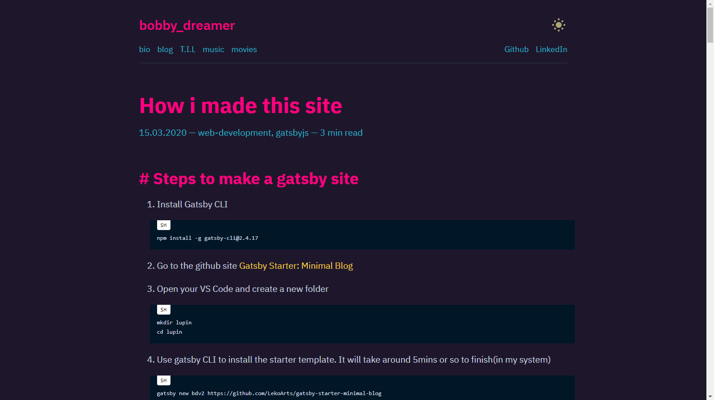 

### # Dark theme : 3 
This theme is inspired from [Brittany Chiang](https://brittanychiang.com/) her website is amazing in so many levels and it uses 
```sh 
    dark:{
      background: `#0a192f`,
      primary: `#fad141`,
      secondary: `#64ffda`,
      heading: `#ccd6f6`,
      toggleIcon: `#fdf498`,
    }
```    

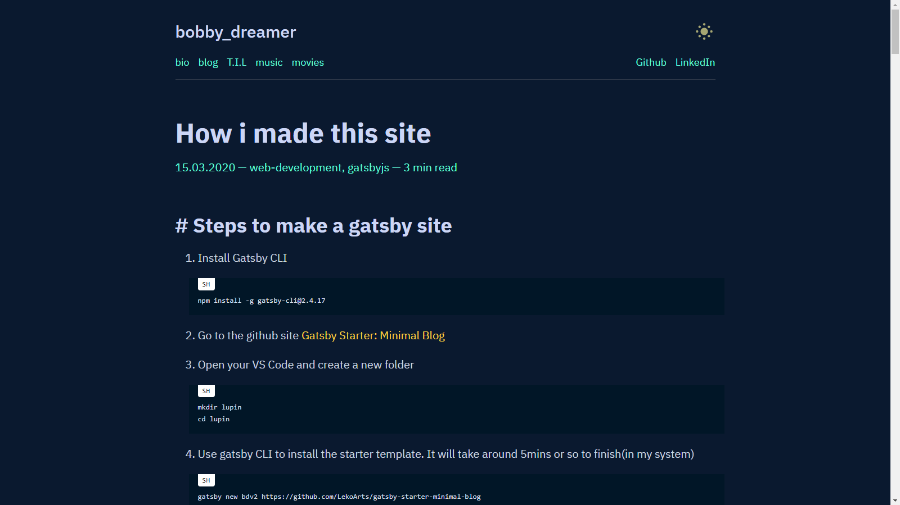 

### # Dark theme : 4 
```sh 
    dark:{
      primary: `#c61a0c`,
      background: `#002a3a`,
      secondary: `#f6411f`,
      heading: `#ffac00`,
      toggleIcon: `#fdf498`,
    }
```    

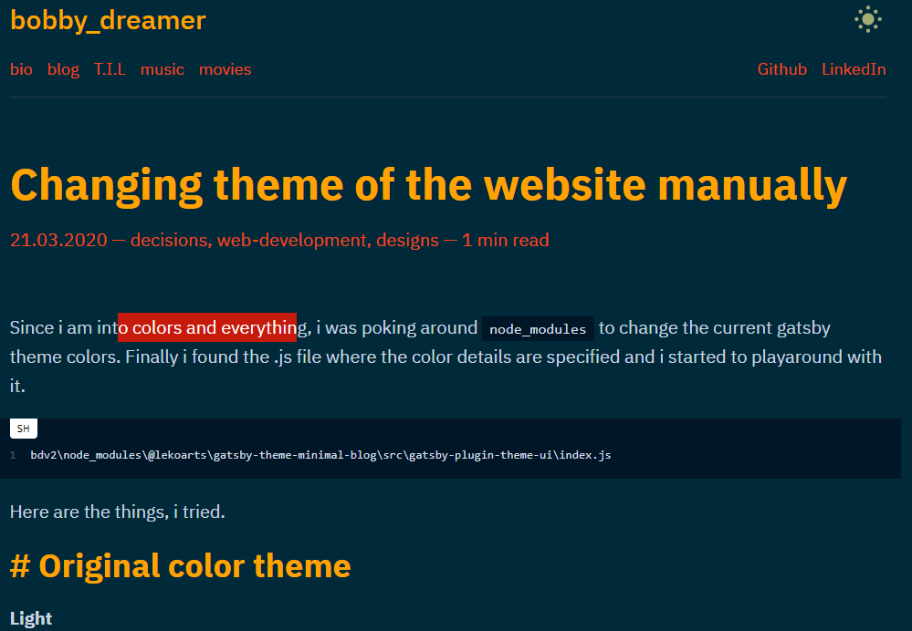 

### # Dark theme : 5
```sh 
    dark:{
      primary: `#ffc884`,
      background: `#30157d`,
      secondary: `#fbff00`,
      heading: `#ffffff`,
      toggleIcon: `#fdf498`,
    }
```    

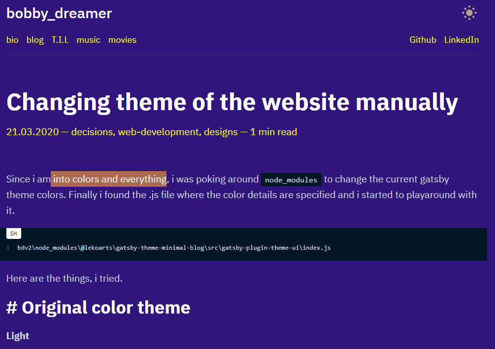 

### # Dark theme : 6 
```sh 
    dark:{
      primary: `#f8c7b6`,
      background: `#21403a`,
      secondary: `#ffd758`,
      heading: `#53c07f`,
      toggleIcon: `#fdf498`,
    }
```    

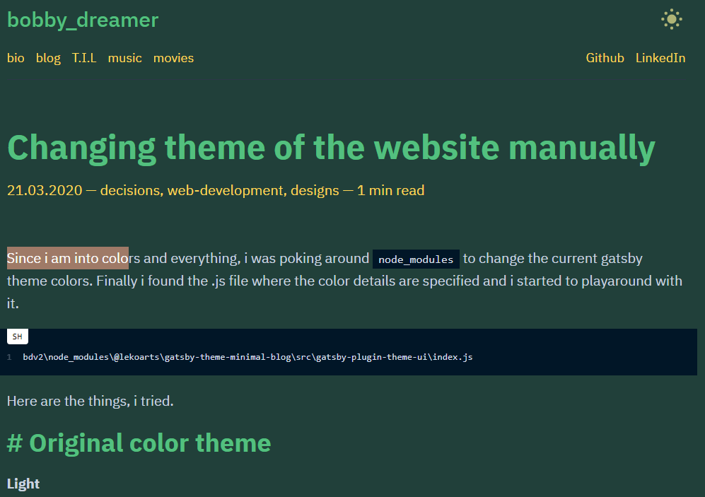  


### # Dark mode inspirations 
Hong Kong neon street colors
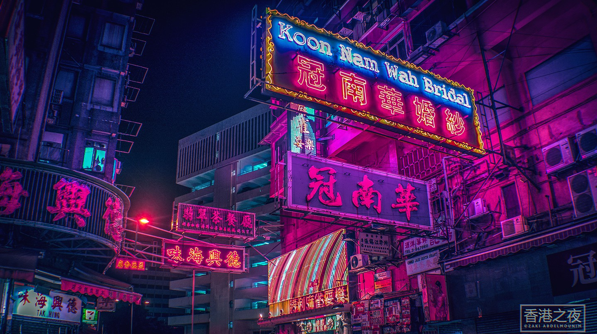 
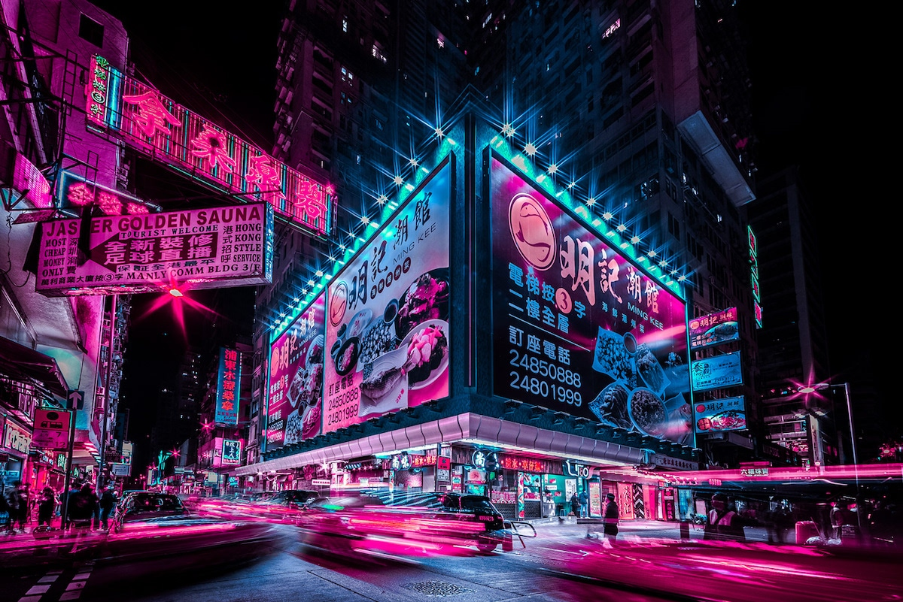 

### # You know who he winner is 

1. Light theme 2
1. Dark theme 2

### # Making these changes permanent
Above i made changes to files in `node_modules` folder but it will get overridden if i do a `npm install` elsewhere. To solve this problem Gatsby has a technique called *shadowing*

Below text is from [Shadowing in Gatsby Themes](https://www.gatsbyjs.org/docs/themes/shadowing/#extending-shadowed-files)
> This feature allows users to replace a file in the src directory that is included in the webpack bundle with their own implementation. This works for React components, pages in src/pages, JSON files, TypeScript files, as well as any other imported file (such as .css) in your site.

To override the file in    
```sh
bdv2\node_modules\@lekoarts\gatsby-theme-minimal-blog\src\gatsby-plugin-theme-ui\index.js
```

created a similar structure in 
```
bdv2\src\gatsby-plugin-theme-ui\index.js
```

This worked and likewise you can shadow many different files and customize your site in Gatsby. 

