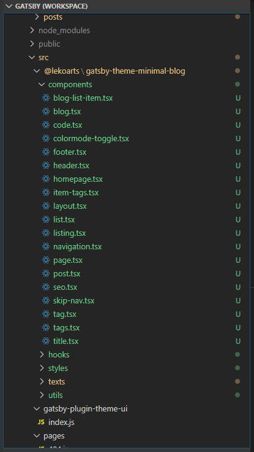

To make your site stand out from the default, you have to make some custom changes.    
Just to let the world know, **"You have started"**

Below are some custom changes which i have made in this site, 

1. To increase number of posts displayed in homepage from default 3. Check the below file, 
  ```text
  site-name\node_modules\@lekoarts\gatsby-theme-minimal-blog-core\src\templates\homepage-query.tsx
  ```

1. Spacing updates ( thought there were big gap between content & texts )
    + Blog post : Increasing space between H4 and previous element    
      Updated `site-name\node_modules\@lekoarts\gatsby-theme-minimal-blog\src\gatsby-plugin-theme-ui\index.js` - Added `mt: 4`    

      ```js
        h4: {
          ...tailwind.styles.h4,
          color: `heading`,
          fontSize: [2, 3, 4],
          mt: 4,
        },
      ```    

    + Home page : Reducing the space between Latest posts and Home projects    
    ```site-name\node_modules\@lekoarts\gatsby-theme-minimal-blog\src\components\listing.tsx```

      ```text
      From = <section sx={{ mb: [5, 6, 7] }} className={className}>
      To   = <section sx={{ mb: [3, 4, 5] }} className={className}>
      ```    
      
    + Home page : Enabling tags in Latest posts    
    ```site-name\node_modules\@lekoarts\gatsby-theme-minimal-blog\src\components\homepage.tsx```

      ```text
      From = <Listing posts={posts} showTags={false} />
      To   = <Listing posts={posts} showTags={true} />
      ```    
      
    + Home page : More space between multiple sections in the bottom    
    ```site-name\node_modules\@lekoarts\gatsby-theme-minimal-blog\src\components\list.tsx```

      ```text
      #FROM 
            ul: { margin: 0, padding: 0},
            li: { listStyle: `none`, mb: 3 },

      #TO
            ul: { margin: 0, padding: 0, mb: 4 },
            li: { listStyle: `none`, mb: 2 },
      ```    

    + Blog page : Reducing the space between Header and Blog title    
      Updated ```site-name\node_modules\@lekoarts\gatsby-theme-minimal-blog\src\components\header.tsx``` 

      ```text
      From = <header sx={{ mb: [5, 6] }}>
      To   = <header sx={{ mb: [4, 5] }}>
      ```    

    + Blog page : Updated space between "Blog" title and list items    
      Updated ```site-name\node_modules\@lekoarts\gatsby-theme-minimal-blog\src\components\blog.tsx```

      ```text 
      From : <Listing posts={posts} sx={{ mt: [4, 5] }} />
      To   : <Listing posts={posts} sx={{ mt: [3, 4] }} />
      ```    
    + All the above changes can be made *permanent*, what do you mean permanent ? If you ask, `npm install` will overwrite all the above changes as modules get installed in `node_modules` folder. So to avoid that and make the changes permanent you can follow, procedures mentioned in [Gatsby Shadowing Concepts](https://www.gatsbyjs.org/docs/themes/shadowing/) and Long story short, basically you will have create folders and files, 

    For instance, take you have updated file in below path,    
    `site-name\node_modules\@lekoarts\gatsby-theme-minimal-blog\src\components\blog.tsx`    
    Copy the file to the below path( create required folders )    
    `site-name\src\@lekoarts\gatsby-theme-minimal-blog\components\blog.tsx`

     Do rememember these files will be having `import` statements and those files need to copied as well. So folder looks like this due to dependent files. 
       

1. Adding 404 page : Create a new page in `site-name/src/pages/404.js` 
    ```text
    import React from "react"

    function NotFoundPage() {
      return <div>Not Found</div>
    }

    export default NotFoundPage
    ```

1. [Adding Google Analytics](/google-analytics)

1. [Adding Favicon](/adding-favicon-to-gatsby)

1. Changing the CODE block font size (updated on 2021-06-01)  

  Path : `src\@lekoarts\gatsby-theme-minimal-blog\styles\code.ts`     
  From : Default size
  ```ts
    ".prism-code": {
      fontSize: [1, 1, 2],
  ```

  To : Bit smaller. There is no decimal sizes like .7 or 1.5
  ```ts
    ".prism-code": {
      fontSize: [1, 1, 1],
  ```

Above are some minimal custom changes, i have done to the site, before the first deployment/implementation. 

### # Next steps 

I will be making more custom changes as maintenance is always an on-going process. 

Below are some custom changes, i have in mind at the moment, 

* 28/03/2020 : [Building a Contact Form](https://www.gatsbyjs.org/docs/building-a-contact-form/)
* 28/03/2020 : [Adding Comments](https://www.gatsbyjs.org/docs/adding-comments/)


### # Related articles
1. [How i made this gatsby site](../how-i-made-this-site)