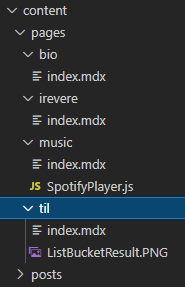
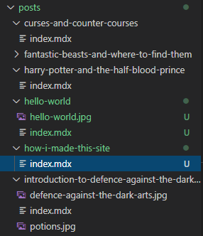
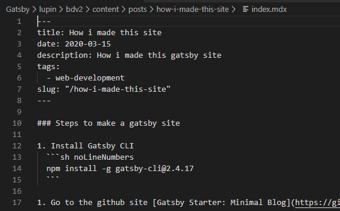

One fine day, i decided to make a new version of my site and thats because of my new acquired knowledge and successful little tests. I have a plan to accomplish this but this project is not time bound like nobody is eagerly waiting for it except me. 

The plan is very simple, "I want to build a site" and in the address bar, i don't want to see .html when the page is displayed. I want to make content and maintain consistent look across the site. Content can be stored in .json or markdown or even better in Firebase storage. Most importantly appearance has to be awesome. 

**Solutions**    

1. There are many solutions to this like [.htaccess](https://www.youtube.com/watch?v=-6LyG9I-FPc), but to me better one is running the application written in NodeJS with Express.
1. To maintain consistency, i can use NodeJS template engines like EJS, PUG, Handlebars, etc... 
1. Data can be retreived from Firebase / Firestore or Firebase storage, think on pricing, coding and how often will you use this. 
1. Awesome appearance. hmmm, get a list of things you want to have and prepare of list of essential things/must have sort of. 

Next few months, mostly i have been working on the requirements, you know the *The Awesome Appearance*, actually was alot occupied at work, so mostly i was just making notes and saving links in [Stash](http://stash.bobbydreamer.com/). And one fine day, i decided i should put a end to all this and make the site and like all successful Software products, there should be a plan/strategy to do this. Honestly to say, i didn't go step by step, i was working parallely in all stages at different times like changing designs and steps based on feasibility. 

This is the thing, **THE SDLC**

| N  | Stages                                   | Activity |
| -- | ---------------------------------------- | ---- |
| 1  | [Plan](/things-that-my-new-site-should-have) | Collectors item / All amazing fancy stuff  |
| 2  | [Define](/epiphany-moment)  | Epiphany Moment. Its going to be a plain content site, nothing else. (PERIOD) |
| 3  | Design | You are here, this is the final product. Next 3 stages are repetitive |
| 4  | Build | Started to add some content here |
| 5  | Test | This is a test till break stage. If it breaks, go back to stage (3)/(4) depending on the issue. If it does not break, then you are in UAT/Pre-PROD zone. Do the final testing. If all OK, move to next stage. |
| 6  | [Deploy](/deploying-and-hosting-gatsby-site-in-firebase) | Truly a ninja moment, nobody knows that this site exists, but it does |
| 7  | Maintenance | Add more content |

### # Steps to make a gatsby site
1. Install NodeJS 

1. Install Gatsby CLI
  ```sh noLineNumbers
  npm install -g gatsby-cli@2.4.17
  ```

1. Go to the github site [Gatsby Starter: Minimal Blog](https://github.com/LekoArts/gatsby-starter-minimal-blog)

1. Open your VS Code and create a new folder 
  ```sh noLineNumbers
  mkdir lupin
  cd lupin
  ```

1. Use gatsby CLI to install the starter template. It will take around 5mins or so to finish(in my system)
  ```sh noLineNumbers
  gatsby new bdv2 https://github.com/LekoArts/gatsby-starter-minimal-blog
  ```

1. Start the template site. 
  ```sh noLineNumbers
  cd bdv2 
  gatsby develop
  ```
   What `gatsby develop` does is, runs the server in the background, enables useful features like live reloading and Gatsby’s GraphQL to query pages & attributes.

1. Visit the site `http://localhost:8000/` in browser of your choice. 

After seeing the site working. First change we will be making is in `gatsby-config.js` and i have highlighted the updated lines
  ```json {7-12,19-38,41-48,55,62-64}
  require(`dotenv`).config({
    path: `.env`,
  })

  module.exports = {
    siteMetadata: {
      siteTitle: `bobby_dreamer`,    
      siteTitleAlt: `BobbyDreamer - Works of Sushanth Bobby Lloyds`,
      siteHeadline: `Personal website of Sushanth Bobby Lloyds`,
      siteUrl: `https://www.bobbydreamer.com`,
      siteDescription: `Sushanth Bobby Lloyds. Programming. Games. Music. Videos. Resume. Experiments.`,
      author: `Sushanth Bobby Lloyds`,
    },
    plugins: [
      {
        resolve: `@lekoarts/gatsby-theme-minimal-blog`,
        options: {
          navigation: [
            {
              title: `bio`,
              slug: `/bio`,
            },          
            {
              title: `articles`,
              slug: `/articles`,
            },
            {
              title: `TIL`,
              slug: `/til`,
            },
            {
              title: `music`,
              slug: `/music`,
            },
            {
              title: `movies`,
              slug: `/movies`,
            },
          ],
          externalLinks: [
            {
              name: `Github`,
              url: `https://github.com/bobbydreamer`,
            },
            {
              name: `LinkedIn`,
              url: `https://www.linkedin.com/in/sushanth-bobby-lloyds/`,
            },
          ],
        },
      },
      {
        resolve: `gatsby-plugin-google-analytics`,
        options: {
          trackingId: process.env.GOOGLE_ANALYTICS_ID,
        },
      },
      `gatsby-plugin-sitemap`,
      {
        resolve: `gatsby-plugin-manifest`,
        options: {
          name: `BobbyDreamer - Works of Sushanth Bobby Lloyds`,
          short_name: `bobby|dreamer`,
          description: `Sushanth Bobby Lloyds. Programming. Games. Music. Videos. Resume. Experiments.`,
          start_url: `/`,
          background_color: `#fff`,
          theme_color: `#6B46C1`,
          display: `standalone`,
          icons: [
            {
              src: `/android-chrome-192x192.png`,
              sizes: `192x192`,
              type: `image/png`,
            },
            {
              src: `/android-chrome-512x512.png`,
              sizes: `512x512`,
              type: `image/png`,
            },
          ],
        },
      },
      `gatsby-plugin-offline`,
      `gatsby-plugin-netlify`,
      // `gatsby-plugin-webpack-bundle-analyser-v2`,
    ],
  }
  ```

#### Changes to home page 
* Updating the text in homepage banner. Its in a file called `hero.mdx`. To change the banner text (`Hi, I'm Lupin...`), create a folder & file in path mentioned in code header below. 
    ```MD:title=main-folder/src/@lekoarts/gatsby-theme-minimal-blog/texts/hero.mdx
    <h3>Hello, I am Sushanth.</h3>

    I am a mainframe Db2 DBA. 

    Yep, mainframe is still there and as usual its highly scalable, highly available and highly secured. 
    Occasionally, Tom Cruise tries to visit us from ceiling, we just look up and say "Hi Tom" and he just panics and says "Code red, mission compromised" and he does his trailer-shot run. :D

    This site is my sandbox, probably will contain collection of my unorganized notes/articles, programming tests, home projects, fav. music, fav. YT videos and VLC screenshots not sure why i take those, mostly stuff i took time to look at.
    ```

* Updating the "Projects" section of the homepage which is in the bottom after "Latest Posts". Create a file in the path mentioned in the code header below.
    ```MD:title=main-folder/src/@lekoarts/gatsby-theme-minimal-blog/texts/bottom.mdx 
    <Title text="Home Projects" />

    - [Stash](http://stash.bobbydreamer.com)
    - [Feedback Management System](https://feedbacks.bobbydreamer.com/)
    ```

#### Adding content  

##### Adding new page
New page insense like, its an isolated page which needs to be in the top header-menu. For this site, i have decided 
to have below pages, for now
+ **bio** - Possibly going to be a long resume
+ **blog** - I have no intention of creating something like article as most of the content is going to be a How-to, Step-by-step and 
if its NON-IT, just few words on why i took time to post about it. So, subsections of this page going to be 
    + Notes - I take notes when i am learning something, if i don't have something elaborate, i am going to put that in notes section.
    + Cheatsheet - This is going to like quick commands to get things done. A quickie. 
    + Article - Notes & Cheatsheet will eventually evolve into this. 
+ **TIL**(Today i learned) - Snippets, life lessons, plans, ideas, todos, bucket list, etc. 
+ **music** - Playlist of favourite songs. Why Youtube has this weird issue, if a song video is deleted, in your playlist it shows as deleted video, but don't know what got deleted to add that back. So here i am going to put that list. 
+ **movies** - I used to be a Movie freak, this section will have list of movies i have watched and few sentences on why i like it. 
+ **fan** - People, whom i followed/follow and get inspiration from. According to me they are the best in what they do. 


**Steps to add new page**   

1. Create a new folder inside `content/pages`

1. Create a new `index.mdx` file
    

1. In `index.mdx` write your frontmatter(title, slug) and content
    

1. Optionally add files/images to the folder you want to reference from the page  

1. Go and update `gatsby-config.js --> navigation`  
  ```js noLineNumbers
      navigation: [
        {
          title: `bio`,
          slug: `/bio`,
        },          
        {
          title: `music`,
          slug: `/music`,
        },
      ],
  ```

##### Adding new post

Posts are something that we create or update regularly, this does not come in header menu. Posts appear in section 
"Latest Posts" in home page(only latest 3 are shown, no options to increase that)

Posts can be created/added by creating MDX files inside `content/posts` folder.

**Steps to add new page**   

1. Create a new folder inside `content/posts`

1. Create a new `index.mdx` file
  

1. In `index.mdx` write your frontmatter(title, date, description, tags and slug) and content below it
  

1. Optionally add files/images to the folder you want to reference from the page

### # Test 

Testing is quite simple. All you need to do is to type the below command, this will start a development server in your machine and watch for changes and refresh the site(just like nodemon)
```sh 
gatsby develop 
```

Below will be the output of the above command 
```sh 
PS D:\BigData\08. HTML\Gatsby\lupin\bdv2> gatsby develop
success open and validate gatsby-configs - 0.271s
success load plugins - 4.072s
success onPreInit - 0.030s
success initialize cache - 0.040s
success copy gatsby files - 0.275s
success onPreBootstrap - 0.039s
success createSchemaCustomization - 0.024s
success source and transform nodes - 1.319s
success building schema - 1.080s
success createPages - 0.280s
success createPagesStatefully - 0.237s
success onPreExtractQueries - 0.015s
success update schema - 0.101s   
success extract queries from components - 1.142s
success write out requires - 0.460s
success write out redirect data - 0.029s
success Build manifest and related icons - 0.027s
success onPostBootstrap - 0.104s
⠀
info bootstrap finished - 18.945 s
⠀
success run queries - 0.183s - 3/3 16.38/s
warn "typescript" is not installed. Builtin ESLint won't be working on typescript files.
⠀
You can now view bobby_dreamer in the browser.
⠀
  http://localhost:8000/
⠀
View GraphiQL, an in-browser IDE, to explore your site's data and schema
⠀
  http://localhost:8000/___graphql
⠀
Note that the development build is not optimized.
To create a production build, use gatsby build
⠀
success Building development bundle - 13.618s
```

You can browse your test site in `http://localhost:8000/`

Sometimes during testing, thing might not work as expected, during those times, *Keep calm and run* `gatsby clean` and then `gatsby develop` again, to see if this worked. 
```sh 
PS D:\BigData\08. HTML\Gatsby\lupin\bdv2> gatsby clean
info Deleting .cache, public
info Successfully deleted directories
```

### # Advantages / Disadvantages of this theme
**Advantages**    

1. Code block - You can highlight specific code lines in a code block, turn on/off line numbers, can mention programming language name and title
1. Blog page will be updated with the list of all the posts in descending order. If post doesn't appear, basically means that .mdx file has issues. Check the VSCode console for any error messages. 
1. Has Dark mode
1. Tagging
1. Images get optimized properly and images have shadow glowing effect

**Disadvantages**    

1. [Gatsby Markdown MDX](https://www.gatsbyjs.org/docs/mdx/markdown-syntax/) - Not all markdown features works like markdown supports html inbetween markdown codes. 
Here there is no line breaks `<br>`
1. Making custom changes to the code, you have to be an expert going through codes in ```node_modules``` folder and sub-folders. 
  ```sh 
  @lekoarts\gatsby-theme-minimal-blog-core
  @lekoarts\gatsby-theme-minimal-blog
  ```
1. [Gatsby Shadowing](https://www.gatsbyjs.org/docs/themes/shadowing/), sometimes it works and sometimes it doesn't. Its a great feature, by the way. 

### # Conclusion
 **Does it fit the purpose ?**    
Yes. I wanted a simple site to dump my learnings, an online archive, wanted it to be fast, responsive with tagging & code highlighting capabilities for posts. This particular gatsby theme has all of it and more, which i am still exploring. 

### # Next steps 
1. [Custom changes](/custom-changes-to-gatsby-theme)
1. [Changing default theme colors](/changing-gatsby-colors-manually)
1. [Deploying & Hosting in Firebase](/deploying-and-hosting-gatsby-site-in-firebase)


**Thank you very much for reading the post**!

